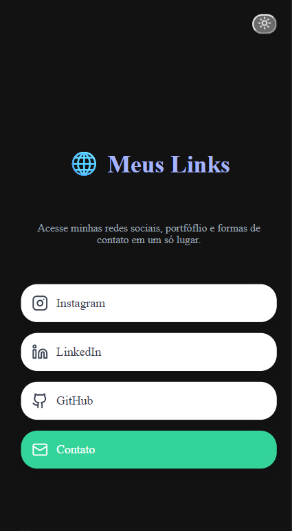

# 🌐 Projeto Meus Links

 )

> Este é um agregador de links pessoal, inspirado no conceito do Linktree, criado para centralizar todas as minhas redes sociais, portfólio e formas de contato em um único lugar. O projeto foi desenvolvido com as tecnologias mais modernas do ecossistema React, incluindo Next.js com App Router e Tailwind CSS para estilização.

### ✨ [Acesse a versão ao vivo aqui!](https://seu-link-publicado.vercel.app/)


---

## 🚀 Funcionalidades

- **Lista de Links Centralizada:** Acesso rápido a todas as redes sociais e contatos importantes.
- **Tema Escuro e Claro:** Botão para alternar entre os temas, com preferência salva no navegador do usuário.
- **Design Moderno e Responsivo:** Totalmente adaptado para visualização em desktops e dispositivos móveis.
- **Tematização com Variáveis CSS:** Arquitetura de cores escalável e de fácil manutenção.
- **Ícones Dinâmicos:** Uso da biblioteca `lucide-react` para ícones claros e minimalistas.
- **Link com Destaque:** Um dos links pode ser destacado para chamar mais atenção (call-to-action).

---

## 💻 Tecnologias Utilizadas
# 🌐 Projeto Meus Links

 )

> Este é um agregador de links pessoal, inspirado no conceito do Linktree, criado para centralizar todas as minhas redes sociais, portfólio e formas de contato em um único lugar. O projeto foi desenvolvido com as tecnologias mais modernas do ecossistema React, incluindo Next.js com App Router e Tailwind CSS para estilização.

### ✨ [Acesse a versão ao vivo aqui!](https://seu-link-publicado.vercel.app/)


---

## 🚀 Funcionalidades

- **Lista de Links Centralizada:** Acesso rápido a todas as redes sociais e contatos importantes.
- **Tema Escuro e Claro:** Botão para alternar entre os temas, com preferência salva no navegador do usuário.
- **Design Moderno e Responsivo:** Totalmente adaptado para visualização em desktops e dispositivos móveis.
- **Tematização com Variáveis CSS:** Arquitetura de cores escalável e de fácil manutenção.
- **Ícones Dinâmicos:** Uso da biblioteca `lucide-react` para ícones claros e minimalistas.
- **Link com Destaque:** Um dos links pode ser destacado para chamar mais atenção (call-to-action).

---

## 💻 Tecnologias Utilizadas

O projeto foi construído utilizando as seguintes tecnologias:

- **Next.js:** Framework React para produção, com renderização no servidor e App Router.
- **React:** Biblioteca para construção de interfaces de usuário.
- **Tailwind CSS:** Framework de estilização CSS "utility-first" para designs rápidos e customizáveis.
- **Lucide React:** Biblioteca de ícones open-source.
- **Vercel:** Plataforma de deploy otimizada para projetos Next.js.

---

## ⚙️ Como Rodar o Projeto Localmente

Siga os passos abaixo para executar o projeto na sua máquina.

**Pré-requisitos:**
- [Node.js](https://nodejs.org/en/) (versão 18 ou superior)
- [npm](https://www.npmjs.com/) ou [yarn](https://yarnpkg.com/)

**Passos:**

1.  **Clone o repositório:**
    ```bash
    git clone [https://github.com/usrJosephC/meus-links.git](https://github.com/usrJosephC/meus-links.git)
    ```

2.  **Navegue até a pasta do projeto:**
    ```bash
    cd meus-links
    ```

3.  **Instale as dependências:**
    ```bash
    npm install
    ```

4.  **Execute o servidor de desenvolvimento:**
    ```bash
    npm run dev
    ```

5.  **Abra o navegador:**
    Acesse [`http://localhost:3000`](http://localhost:3000) para ver o projeto em execução.

---

## 📄 Licença

Este projeto está sob a licença MIT. Veja o arquivo [LICENSE](LICENSE) para mais detalhes.

---

Feito com ❤️ por **Joseph Cavalcante**.
O projeto foi construído utilizando as seguintes tecnologias:

- **Next.js:** Framework React para produção, com renderização no servidor e App Router.
- **React:** Biblioteca para construção de interfaces de usuário.
- **Tailwind CSS:** Framework de estilização CSS "utility-first" para designs rápidos e customizáveis.
- **Lucide React:** Biblioteca de ícones open-source.
- **Vercel:** Plataforma de deploy otimizada para projetos Next.js.

---

## ⚙️ Como Rodar o Projeto Localmente

Siga os passos abaixo para executar o projeto na sua máquina.

**Pré-requisitos:**
- [Node.js](https://nodejs.org/en/) (versão 18 ou superior)
- [npm](https://www.npmjs.com/) ou [yarn](https://yarnpkg.com/)

**Passos:**

1.  **Clone o repositório:**
    ```bash
    git clone [https://github.com/usrJosephC/nome-do-seu-repositorio.git](https://github.com/usrJosephC/nome-do-seu-repositorio.git)
    ```

2.  **Navegue até a pasta do projeto:**
    ```bash
    cd nome-do-seu-repositorio
    ```

3.  **Instale as dependências:**
    ```bash
    npm install
    ```

4.  **Execute o servidor de desenvolvimento:**
    ```bash
    npm run dev
    ```

5.  **Abra o navegador:**
    Acesse [`http://localhost:3000`](http://localhost:3000) para ver o projeto em execução.

---

## 📄 Licença

Este projeto está sob a licença MIT. Veja o arquivo [LICENSE](LICENSE) para mais detalhes.

---

Feito com ❤️ por **Joseph Cavalcante**.